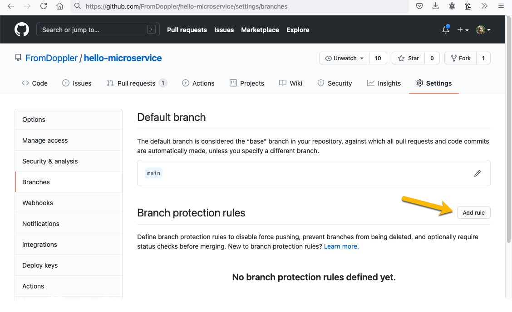
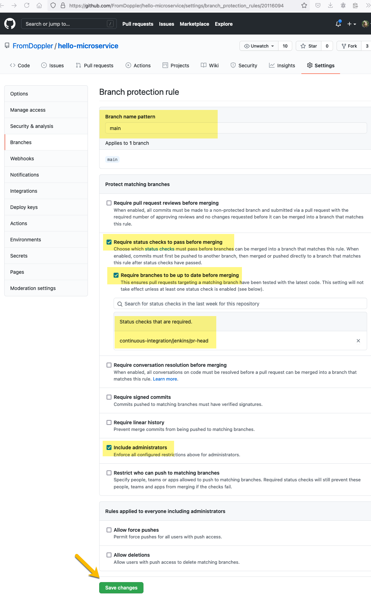
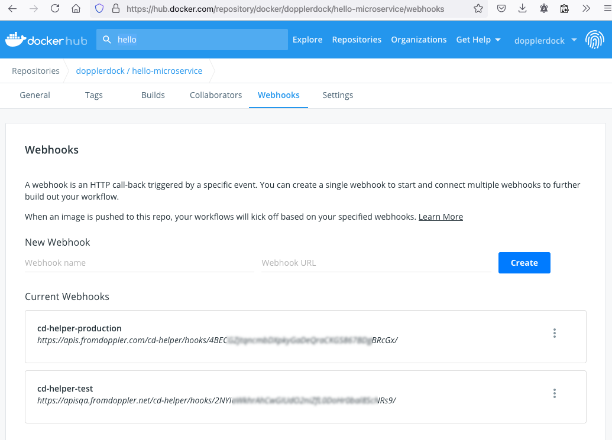

# mercadopago-api

A basic template for a Doppler microservice based on .NET with CI, CD, Code Formatting, Authentication, and other common practices in Doppler teams.

For the moment, it is only a kind of example. In the future, it could be converted into a _Yeoman_ or _dotnet new_ scaffolding template 🤷‍♂️.

## Context

We base our CI/CD process on Jenkins, Docker Hub, and Docker Swarm.

Jenkins generates the images based on [.doppler-ci](./.doppler-ci) (a symlink to [Jenkisfile](./Jenkinsfile)). We refer to these generated images in a Docker Swarm using an _auto-redeploy_ approach. The [Doppler Swarm repository](https://github.com/MakingSense/doppler-swarm) stores the configuration of our Docker Swarm.

You can find a detailed description of our Git flow and the relation with Docker Hub in [Doppler-Forms repository](https://github.com/MakingSense/doppler-forms/blob/master/README.md#continuous-deployment-to-test-and-production-environments), but basically, it is the following:

- Pull Requests generates images with tags like `pr-177` (`pr-{pull request id}`) and (`pr-{pull request id}-{commit id}`).

- Merging in `main` (or `master` in some repositories) generates images with tags like `main` and `main-60737d6` (`main-{commit id}`). In general, these images are deployed automatically into the QA environment.

- Resetting the branch `INT` generates images with tags like `INT` and `INT-60737d6` (`INT-{commit id}`). In general, these images are deployed automatically into the INT environment.

- Tagging with the format `v#.#.#` generates images with tags like `v1`, `v1.3`, `v1.3.0`, `v1.3.0_982c388`. In general, our Production environment refers to images with tags like `v1` (only the mayor), so, depends on that, these images could be deployed automatically to the Production environment.

## Run validations in local environment

The source of truth related to the build process is [.doppler-ci](./.doppler-ci) (a symlink to [Jenkisfile](./Jenkinsfile)). It basically runs docker build, so, you can reproduce jenkins' build process running `docker build .` or `sh ./verify-w-docker.sh`.

If you prefer to run these commands without docker, you can read [Dockerfile](./Dockerfile) and follow the steps manually.

## Features

- Base conventions for a .NET/C# project.

- Normalize to Linux line endings by default for all files (See [.editorconfig](./.editorconfig) and [.gitattributes](./.gitattributes)).

- Ignore from git and docker files with the convention that denotes secrets (See [.gitignore](./.gitignore) and [.dockerignore](./.dockerignore)).

- Prettier validation for all supported files.

- Editor Config validation using `dotnet-format` and `eclint`.

- Launch and debug settings for VS Code ([.vscode](./.vscode)) and Visual Studio ([launchSettings.json](./Doppler.HelloMicroservice/../Doppler.HelloMicroservice/Properties/launchSettings.json)).

- Custom color for VS Code (using [Peacock](https://marketplace.visualstudio.com/items?itemName=johnpapa.vscode-peacock&wt.mc_id=vscodepeacock-github-jopapa), see [settings.json](./.vscode/settings.json)).

- Format validation, build and test run in CI process.

- Generation of the docker images following Doppler convention and publish them to Docker Hub (See [build-n-publish.sh](./build-n-publish.sh)).

- Generation of `version.txt` file with the image version in `wwwroot`. Also, expose it using _static files_ middleware.

- [demo.http](./demo.http) to easily add manual tests for the exposed API with [VS Code REST Client](https://marketplace.visualstudio.com/items?itemName=humao.rest-client).

- Exposing only HTTP (not HTTPS) because that is the responsibility of our reverse proxy.

- Allow overriding project settings based on our Doppler conventions.

- Expose Swagger (with support for segment prefix).

- Including an example of a self-hosting integration test.

## How to use this project

### Prepare the files

By the moment it is only an example that could be used to create new APIs or even services.

A simple way of doing that is copy all the files and then:

- Delete all `bin` and `obj` folders

- Rename all the files and folder names from `Doppler.HelloMicroservice` to the desired names.

  For example `Doppler.HelloMicroservice.Test/Doppler.HelloMicroservice.Test.csproj` to `Doppler.SuperAPI.Test/Doppler.SuperAPI.Test.csproj`

- Case sensitive _search and replace_ all occurrences of `Doppler.HelloMicroservice` to the desired name.

  **IMPORTANT:** Some files are not included in the VS Solution, you should search for `Doppler.HelloMicroservice` in **ALL** the files.

- Case sensitive _search and replace_ all occurrences of `mercadopago-api` to the desired name.

  **IMPORTANT:** Some files are not included in the VS Solution, you should search for `mercadopago-api` in **ALL** the files.

- Replace the IDs in the .sln file.

  We have `{FC79D827-86F3-4F93-8064-C4927957A1D2}` for the main project, `{646F92A1-8B19-43E0-BED1-8A56B6FB9352}` for the test project, `{9BE75F53-F47E-4B35-9560-AA039EBC5B1C}` for the solution files and `{A6DDDBE4-738F-4679-809B-D7786BD5E7E5}` for the solution itself. It is possible generate new IDs using any tool, for example [Online GUID / UUID Generator](https://www.guidgenerator.com/)

- Ensure that the file `.doppler-ci` is a _symbolic link_ to `Jenkinsfile`

  **IMPORTANT:** If you do not know what a symlink is, ask.

  - In Linux or Mac: `ln -s Jenkinsfile .doppler-ci`
  - In Windows (with git bash as administrator): `export MSYS=winsymlinks:nativestrict; ln -s Jenkinsfile .doppler-ci`

### Push to GitHub

We are using the GitHub organizations [FromDoppler](https://github.com/FromDoppler) (for public code) and [MakingSense](https://github.com/MakingSense) (for private code).

Create a new empty project there, and create a PR to push the updated files. It should start a CI process in our Jenkins server.

### Configure GitHub branch protection rules

In [GitHub Branches Settings](https://github.com/FromDoppler/mercadopago-api/settings/branches) add a new protection rule for the `main` branch.

With the following configuration:

- **Branch name pattern**: `main`
- **Require status checks to pass before merging**: _checked_
- **Require branches to be up to date before merging**: _checked_
- **Status checks that are required**: `continuous-integration/jenkins/pr-head`
- **Include administrators**: _checked_

### Configure Docker Hub Webhooks

At this point, the CI process already generated a Docker Hub repository and we should configure the WebHooks to enable the auto-redeploy in our environments.

**IMPORTANT:** You need the credentials of `dopplerdock` Docker Hub account. Ask for them.

Open the Webhooks configuration page of this new repository (this is the URL for mercadopago-api repository: <https://hub.docker.com/repository/docker/dopplerdock/mercadopago-api/webhooks>) and create the webhooks for production and test environments:

- **cd-helper-production** `https://apis.fromdoppler.com/cd-helper/hooks/{{REEMPLACE-THE-SECRET-HERE}}/`
- **cd-helper-test** `https://apisqa.fromdoppler.net/cd-helper/hooks/{{REEMPLACE-THE-SECRET-HERE}}/`

**IMPORTANT:** You can see the secrets in other Docker Hub repositories, for example in [_CD-Helper_'s one](https://hub.docker.com/repository/docker/dopplerdock/doppler-cd-helper/webhooks).

### Add the stack to Doppler Swarm repository

We should add the stack to [Doppler Swarm repository](https://github.com/MakingSense/doppler-swarm), it is possible using `hello-stack` as reference. Using _search in files_ is recommended to find all the places to update.
