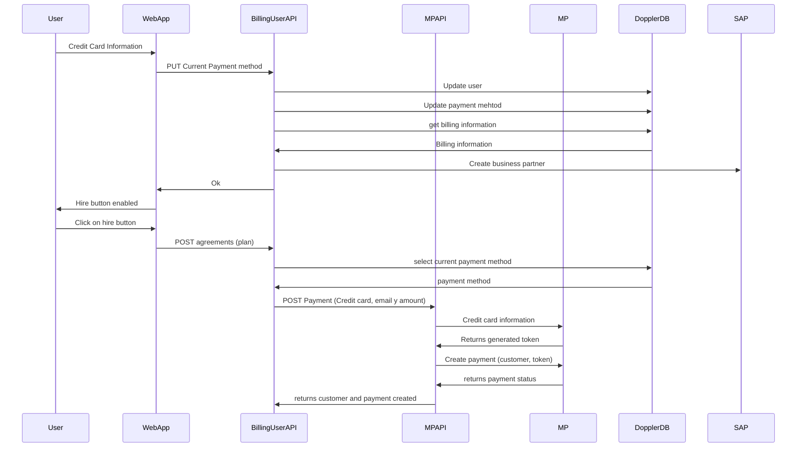

# mercadopago-api

API for processing payments with Mercado Pago.

## Sequence Diagram

```mermaid
sequenceDiagram
    participant User
    participant WebApp
    participant BillingUserAPI
    participant MPAPI
    participant MP
    participant DopplerDB
    participant SAP
    User->>WebApp: Credit Card Information
    WebApp->>BillingUserAPI: PUT Current Payment method
    BillingUserAPI->>DopplerDB: Update user
    BillingUserAPI->>DopplerDB: Update payment mehtod
    BillingUserAPI->>DopplerDB: get billing information
    DopplerDB->>BillingUserAPI: Billing information
    BillingUserAPI->>SAP: Create business partner
    BillingUserAPI->>WebApp: Ok
    WebApp->>User: Hire button enabled
    User->>WebApp: Click on hire button
    WebApp->>BillingUserAPI: POST agreements (plan)
    BillingUserAPI->>DopplerDB: select current payment method
    DopplerDB->>BillingUserAPI: payment method
    BillingUserAPI->>MPAPI: POST Payment (Credit card, email y amount)
    MPAPI->>MP: Credit card information
    MP->>MPAPI: Returns generated token
    MPAPI->>MP: Create payment (customer, token)
    MP->>MPAPI: returns payment status
    MPAPI->>BillingUserAPI: returns customer and payment created
```
